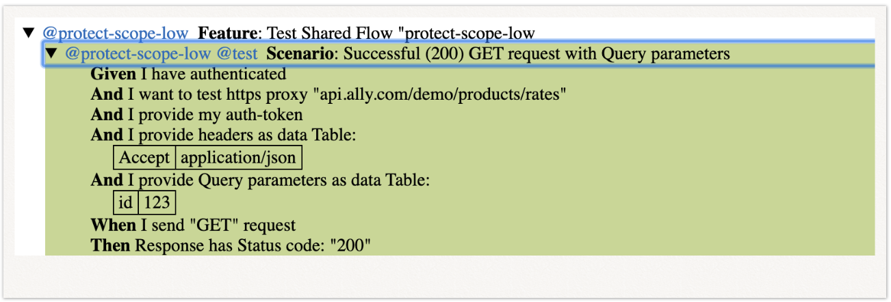
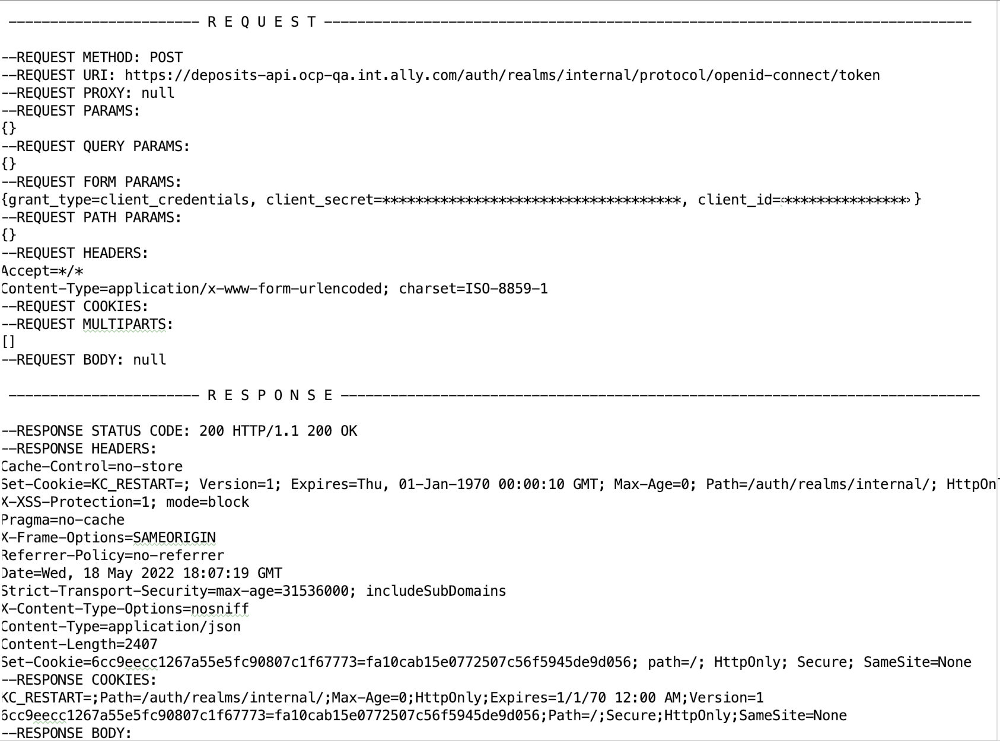

# What’s required to put together Watchmen Framework
------
**Watchmen Framework - test automation framework based on BDD Cucumber-JVM**   

------

## Example Project 

 - Please clone example project where we show how fast and easy you can test CoinBase public APIs  

------

## Project Structure

 - Watchmen packaged as a JAR file and stored in Maven Central Repository
 - To download Watchmen Jar From Maven Central Repository please add to POM.xml: 
 
         <dependency>
             <groupId>io.github.ally-financial</groupId>
             <artifactId>watchmen</artifactId>
             <version>1.0.0-SNAPSHOT</version>
         </dependency>
        
        Note:  1.0.0-RELEASE coming soon 
        
 - To register and inject project's properties Watchmen uses Spring framework, check SpringConfig.java
 - To configure Spring to use property file you need to update class SpringConfig.java:
        
        @PropertySource("config.properties")
 
 - Cucumber-JVM utilises dependency injection using Spring. To configure Cucumber and Spring integration check cucumber.xml under resources 
  
  
         <context:annotation-config/>
         <bean name="SpringConfig" class="com.ally.demo.config.SpringConfig"/>

## Overview

 - Testing scenarios are created by steps in Gherkin 
 - The glue between Gherkin and the system under test are implemented as regular Java methods and implemented in regular Java classes.
 - Dependency injection implemented using Spring.
 - Cucumber JVM integrated with Spring.
 - To run Cucumber feature files Watchmen uses JUnit runner.
 - For reports Cucumber generates reports in the form of HTML, XML, JSON & TXT
 - Watchmen also provides Cluecumber reports and detailed logs.

---

## Feature File

 - Feature files group related scenarios.

 - Testing scenarios are created by steps in Gherkin. Most lines in a Gherkin document start with one of the keywords.

 - The feature file should be called \<featureName\>.feature and placed under src/main/resources/features/

Here’s the example of the feature file:

     Feature: Very first scenario
     @first
       Scenario: very first scenario
     
         Given I want to call API Endpoint "https://www.google.com"
         And   I provide headers as data Table:
     
           |Content-Type|application/json; charset=utf-8|
     
          And I send "GET" request
          Then Response has Status code: "200"
          

---

## Steps Sefinition

 - The glue between Gherkin and the system under test are implemented as regular Java methods and implemented in regular Java classes "CommonApiStepsDefinition.java" and "AwsStepsDefinition.java".

 - To hide implementation details "CommonApiStepsDefinition.java" and "AwsStepsDefinition.java" calling several reusable helper methods:

    - RequestHelper
    - ResponseHelper
    - JsonHelper
    - XmlHelper
    - DataBaseHelper
    - ...

 - All available Watchmen steps and their algorithms please see on WATCHMEN_STEPS.md 
 - If you decide to add your own step definitions, you need to create step definition class. 
 - It should be called something like <StepsDefinition>.java and be added under src/java/com/demo/steps/
---

## Managing Dependency Between Steps

 - A scenario in Gherkin is created by steps. Each step depends on previous steps result. This means that we must be able to share state between steps. 

 - Class TestScope.java holding the state of scenario. This is a singleton and to create and managing instances of this class Watchmen using Spring library. Spring will do all dependency managing, including making sure instance ends up where we need it. 

 - To configure Spring Watchmen has a class called \<SpringConfig\>.java under src/main/java/com/ally/d3/watchmen/config. 

 - To avoid leakage between scenarios Watchmen resets TestScope on "Before" hook. 

---

## Execute Tests

 - To run Cucumber feature files Watchmen uses JUnit test runner.

 - To configure JUnit runner Watchmen needs a file called \<featureName\>.java under src/main/java/com/ally/d3/watchmen/testRunner/

 - Here’s the example of the test runner file:

          @RunWith(Cucumber.class)
            @CucumberOptions(
                features = "src/main/resources/features",
                glue = "com/ally/d3/watchmen/steps",
                tags ={"@oauth","not @skip"},
                plugin = {"pretty", "html:target/cucumber/bagbasics",
                      "junit: target/cucumber/bagbasics/cucumber.xml", "json:target/cucumber-report/cucumber.json"}
                )
      
          public class TestRunnerTemplate {
      
           }

 - The @RunWith (Cucumber.class) annotation on the TestRunner class tells JUnit to kick off Cucumber. 
 - Cucumber run time parses the command-line options to know what features to run, where the glue code lives, what plugins to use, and so on.

The above configurations telling Cucumber next things:

 - to look for the feature files in src/main/resources/features/
 - to look for the step definition files in com/ally/d3/watchmen/steps
 - to run scenarios only with tag @oauth and to not run scenarios with tag @skip
 - to generate XML report on target/cucumber-reports/ and name it cucumber.xml
 - to generate Json report on target/cucumber-report/cucumber/ and name it cucumber.json
 - to format cucumber.xml on monochrome style

For more information please see Cucumber Reference

---

## Watchmen Reports

For reports Cucumber can generate reports in the form of HTML, XML, JSON & TXT, depends on settings on runner file

Example of Cucumber.xml report: 

#  

Example of Cucumber.html report: 

#  

Example of Cucumber reports plugin Cluecumber:

#  

---

## Watchmen Logs

Watchmen is a Spring boot application:
 - Logging is built in 
 - Logger.Factory.getLogger() for logger instance 
 - Uses Logback (by default) 
 - Log levels - info, debug, error and trace (for request-response)
 - Sensitive information is masked (see settings on logbook.xml)
 - For logs configuration you need to use logback.xml stored under Resources.

Example of Watchmen logs for request-response:

#  

---

## How to Try This Project

- Clone example project to your local folder
- Go to SDK and create new project from existing source (provide path to the POM.xml of example project)
- Watchmen is Maven project - to make sure your project is fine and all dependencies are on place - build it.
       
       run command:   mvn compile
       

- Check config.properties file and provide request settings: 

      # Set use proxy, proxy host, proxy port if your don't want to use the system default settings but want to have a control over proxy 
      # By default = false
      # Proxy Auth - proxyUser & proxyPassword  must be set up on your system default settings 
         
         host=10.100.100.100
         port=8
         useProxy=true
     
       
      #Defime if you need to use relaxed HTTP validation. This means that you'll trust all hosts regardless if the SSL certificate is invalid. 
      #By default = false
         
          useRelaxedHTTPSValidation=true
          
       # Handling Asynchronous Wait. This settings works with the step "I send "\<request type\>" request and wait for the Response \<Response code\>"
          
          waitForResponseSeconds=10
 
          
          
 - To execute demo scenarios run command:        
       
          mvn test  -Dtest=CoinBaseTestsRunner
       
       
**This is it. Now your are ready to start testing your API**

- Create new feature.file
- Create your Scenarios reusing existing steps 
- Update config.properties file with runtime variables if needed
- Create your  Run_your_feature.java class using template under src/main/java/testRunner.
- Execute Run_your_feature.java

---

## Cucumber and Gherkin plugins for SDK

Use these plugins to enable Cucumber support with step definitions written in Java. The following coding assistance features are available:

 - Error and syntax highlighting.
 - Indentation.
 - Intention actions.
 - Viewing code structure.
 - Navigation in the source code.
 - Integrated documentation.
 - Code completion.
 - Search for usages.
 - Commenting and uncommenting lines.

