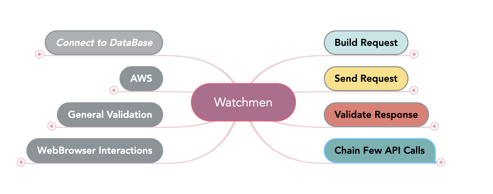

# Watchmen

**API Automation**   


------


## Steps

#  

---


- **I want to call API Endpoint "<>"**
    - Create new instance of RequestSpecBuilder
    and add to the RequestSpecBuilder URL provided on the step (after resolving all placeholders) and Proxy host and port (config.properties file) if useProxy=true
    
    - Examples: 
    
          I want to call API Endpoint "{{alerts_URL}}"
    
          I want to call API Endpoint "https://dev.ally.com/{{alerts_endpoint}}"
               
        
     "alerts_endpoint", "alerts_URL" have to be provided on config.properties or as a runtime variable
     
          
          

---
    
- **I provide basePath as "<>"**
    - Resolve all placeholders and add to the request specification "/basePath"
---

- **I provide path variables as data Table:
         |path_id|path_value |**
    -  Read data table and for the each row resolve placeholders and add to the request specification PathVariables
---

- **I provide query parameters as data Table:
         |param_id|param_value |**
    - Read data table and for the each row resolve placeholders and add to the request specification Query parameters    
---

- **I provide query parameter "key" as "values"**
    - Split values by "," resolve placeholders for each value and add to the request specification: Query parameters
---

- **I provide headers as data Table:
          |header|value |**
    - Read data table and for the each row resolve placeholders and add to the request specification header = value 
---

- **I provide headers as csv file "file_name.csv"**
    - Read "file_name.csv" file resolve all placeholders and add to the request specification header = value.
      File must be stored under resources, first row of the file will be skipped as it is header
---
      
- **I provide cookies as data Table:
    |cookie|value |**
    - Read data table and for the each row resolve placeholders and add to the request specification:
       <cookie_name = cookie_value>
---
       
- **I provide body as String: "my payload"**
    - Add to the request specification body as a String
---
    
- **I provide body as raw JSON file "payload.json"**
    - Read "payload.json" file, resolve all placeholders and if it exists add to the request specification body as a String
---

- **I provide body as raw XML file "filename"**
    - Read "payload.xml" file, resolve all placeholders and if it exists add to the request specification body as a String  
---

- **I provide form data as data Table:
    |data|value |**
    - Read Data table and resolve all placeholders and add to the request specification: FormParams               
---

- **I provide form data as csv file "file_name.csv"**
    - Read "file_name.json" file, resolve all placeholders and if it exists - resolve all placeholders and add to the request specification: FormParams
      File must be stored under resources, first row of the file will be skipped as it is header
---

- **I provide my token "token" as a Bearer token on Authorization header**
    - Resolve placeholdersBearer for token and add "Bearer" followed by a space and token as Authorization header
---

- **I provide user name "user" and password "pwd" as a Basic authentication on Authorization header**
    - Resolve placeholders for user and password and add "Basic" followed by base64-encoded string user:password as Authorization header
---

- **I set JSON body node "JSON_node_path" to "value"**
    - Read request specification body, locate requested body node using JSON_node_path. New node value (after resolving all placeholders) will replace the old value 
      Assign updated Json as new Request payload.
---

- **And I set JSON body node to value:
    |JSON_node_path|value |**
    - Read data table and for the each row: read request specification body, locate requested body node using JSON_node_path. New node value (after resolving all placeholders) will replace the old value 
      Assign updated Json as new Request payload.
---

- **I add JSON node "node_name" to Parent node "parent_JSON_path" as value "value"**
    - Read request specification body, locate requested parent body node using parent_JSON_path,
      Add new node "node_name" under parent node with new value after resolving all placeholders.
      Assign updated Json as Request payload
---

- **I add JSON node "node_name" to Parent node "parent_JSON_path" as raw JSON "file.json"**
    - Read request specification body, locate requested parent body node using parent_JSON_path,
      Add new node "node_name" under parent node, Resolve all placeholders for the file name, Read file content as a String
      and set new node value as content of the file. Assign updated Json as Request payload
---

- **I add new item to JSON Array node "arrayNode_jsonPath" as raw JSON "file.json""**
    - Read request specification body, locate requested node of type Array using arrayNode_jsonPath,
      Resolve all placeholders for the file name and read file content as a String.
      Add new item to the array node as file content. Assign updated Json as Request payload
---

- **I remove JSON body node "JSON_node_path"**
    - Read request specification body, locate requested body node using JSON_node_path.
      Remove node and assign updated Json as Request payload
---
      
- **I copy JSON tree from "parent.node" and add it under Array node "new_parent.node"**
    - Read request specification body, locate requested parent.node using JSON_node_path. Copy entire child JSON tree from the  parent.node
      Locate requested new_parent.node using JSON_node_path and paste copied JSON tree as a new item to the Array.
      Assign updated Json as Request payload
---
      
- **I copy JSON tree from "parent.node" and add it under Parent node "new_parent.node" as new node "new_node.name"**
    - Read request specification body, locate requested parent.node using JSON_node_path, copy entire child JSON tree from the  parent.node
      Locate requested new_parent.node using JSON_node_path and add new node new_node.name. Set new_node.name as  a JSON tree. 
      Assign updated Json as Request payload
---
       
- **I set XML body node "Xpath" to "new_value"**
    - Using  this step you can change any node of type Element or Attribute on runtime. Read request specification body, locate requested body node using Xpath. New node value (after resolving all placeholders) will replace the old value 
      Assign updated XML as a new Request payload.                        
---

 - **I set XML body node to value:
       |Xpath|new_value|**
     - Using  this step you can change any node of type Element or Attribute on runtime. Read data table and for the each row: read request specification body, locate requested body node using Xpath. New node value (after resolving all placeholders) will replace the old value 
       Assign updated XML as a new Request payload. 
---
       
- **I add XML node "new_node_name" to Parent node "parent_Xpath" with value "new_node_value"**
    - Using this step you can add child node of type Element to any other XML node. Read request specification body, locate requested body node using Xpath. New node value (after resolving all placeholders) will be added. 
      Assign updated XML as a new Request payload. 
---
      
- **I add attribute "attr_name" to XML node "Xpath" with value "attr_value"**
    - Using this step you can add attribute to the node of type Element. Read request specification body, locate requested body node using Xpath. Add attribute (after resolving all placeholders).
      Assign updated XML as a new Request payload.       
---
      
- **I remove XML body node "Xpath"**
    - Using this step you can remove any node of type Element. Read request specification body, locate requested body node using Xpath. Remove node. 
      Assign updated XML as a new Request payload.       
---
      
      
- **I remove attribute "atr_name" from XML body node "Xpath"**
    - Using this step you can remove any node of type Attribute.. Read request specification body, locate requested body node using Xpath. Remove attribute.
      Assign updated XML as a new Request payload.       
---
      
- **I send "GET|POST|PUT|DELETE" request**
    - Watchmen will use Request specification defined on all previous steps. Based on provided request type Watchmen will get() | post() | put() | delete()|patch()
      Result will be stored in scenarios scope as: testScope.responseToValidate
---
           
- **I send "Request type" request and wait for the Response "Response code"**
    - Request being sent repeatedly once per second for X seconds till returned status code is as expected. Once timeout has exceeded and response is not as expected, step fails.
      By default request being executed once per second for 5 seconds. To change default polling time add to config.properties 
      waitForResponseSeconds=X      
---
      
- **Response has Status code: "Status code"**
    - Assert that Response has expected status code       
---
      
- **Response has Content Type "Expected Content Type"**
    - Assert that Response has expected Content Type
---
      
- **Response has response time < <integer> milliseconds**
    - Assert that Response time less then expected (milliseconds)       
---
      
- **Response has next header with the name: "header_name"**
    - Assert that Response has expected header      
---
            
- **Response header "header_name" has next value: "value"**
    - Assert that Response has Header "header_name" and if true - Resolve all placeholders for the expected value
      Assert that header has expected value ignoring case      
---
      
- **Response has ALL the headers from data Table:
    |header_name|**
    - Read data table and create list of expected headers. Assert that Response has all the headers from list.
      If some headers from the expected list missed on response - step fail.
      If response has some additional headers - step not fail
---
    
- **Response has ALL the headers from csv file: "headers.csv"**
     - Resolve all the placeholders for file name. Read file and build list, assert that Response has all the headers from list.
       If some headers from the expected list missed on response - step fail.
       If response has some additional headers - step not fail
---
       
- **Response has ALL the headers from data Table and ONLY that:
    |header_name|**
    - Read data table and create list of expected headers. Assert that Response has all the headers from list.
      If some headers from the expected list missed on response - step fail.
      If response has some additional headers - step fail
---   
- **Response has ALL the headers from csv file "file_name.csv" and ONLY that**
    - Resolve all the placeholders for file name. Read file and build list, 
      Read data table and create list of expected headers. Assert that Response has all the headers from list.
      If some headers from the expected list missed on response - step fail.
      If response has some additional headers - step fail
---
    
- **Response body JSON has Node: "JSON_node_path"**
    - Assert that Response body JSON has expected Node using JSON_node_path
---
    
- **Response body JSON node equal to val:
     |JSON_node_path|value|**
    - Read Data table and for the each row: assert that Response body has expected node using JSON_node_path.
      If first step is true - resolve placeholders and Assert that Node value equals to "Value" ignoring case.
      Step Fails if node not found
---
    
- **Response body JSON node contains String:
     |JSON_node_path|value|**
    - Read Data table and for the each row: assert that Response body has expected node using JSON_node_path.
      If first step is true - resolve placeholders and Assert that Node value contains "Value" ignoring case.
      Step Fails if node not found
---
    
- **Response body JSON node "JSON_node_path" is an array of size =XX**
    - Assert that Response body has expected node using JSON_node_path
      If first step is true - Assert that node is an array of expected size.
      If requested node is not an array but a single value - size = 0.
      Step Fails if node not found
---
    
- **Response body JSON matches schema "schema.json"**
    - Assert that Response body JSON matches schema "schema.json" Path to the schema file can be provided using placeholders.
      If validation fails - report provided for further analyses.
      "schema.json" must be stored under Resources.
---
    
- **Response body JSON matches swagger file "file_path" schema "definition_pointer"**
    - Resolve all placeholders for "file_path" and locate swagger file (yaml or json)
      Read swagger file, locate schema on swagger file using definition_pointer and build json schema.
      Validate response using json schema. If validation fails - report provided for further analyses.
      Swagger file must be stored under Resources.
---
    
- **And Response body JSON matches JSON file "file_path"**
    - Resolve all placeholders for "file_path" and locate json file. Read response and assert response matches json file.
      Please see for more information: https://www.baeldung.com/jackson-compare-two-json-objects.
      In case of error Watchmen fails step and provide report where it is the difference 
---
    
- **Response body XML node equals to val:
          |Xpath|value|**
    - Read Data table and for each row: assert that Response body has expected node using xpath.
      If first step is true - resolve placeholders and Assert that Node value equals to "Value" ignoring case
---
                                                                  
- **Response body XML node contains val:
    |Xpath|value|**
    - Read Data table and for each row: assert that Response body has expected node using xpath.
      If first step is true - resolve placeholders and Assert that Node value contains "Value" ignoring case       
---
           
- **I store Response header "header_name" as "key" in the scenario scope**
    - If "header_name" found on the Response - store (key,header_value) in the Scenario scope.
      If "header_name" does not found on the Response  - step will Fail
---

- **I store Cookie "cookie_name" as "key" in the scenario scope**
    - If "cookie" found on the Response - store (key,cookie_value) in the Scenario scope.
      If "cookie" does not found on the Response - step will Fai
---

- **I store JSON Response body node "JSON_node_path" as "key" in the scenario scope**
    - If "JSON_node_path"  found on the JSON Response - store (key,node_value) in the Scenario scope.
      If "JSON_node_path" not found on the Response -  step will Fail
---

- **I store XML Response body node "xpath" as "key" in the scenario scope**
    - Assert that Response body XML has expected node using xpath
---

- **Response body XML has node: "Xpath"**
    - If node found using "xpath" on the XML Response  - store (key,node_value) in he Scenario scope.
      If node not found using "xpath"  -  step will Fail
---

- **And I establish connection to Data Base "DB""**
    - Currently Watchmen supports Oracle DB and Aurora DB (aws) connection
    - Watchmen reads information about requested connection to DB during launch time from the config.properties (spring.profiles.active)
    - By default (if spring.profiles.active not specified) there are no connection to any DB
    - On this step Watchmen will verify the connection to the Data Base SUCCESSFUL by executing "SELECT 1 FROM DUAL"
    - If provided DB credentials or URL connection are invalid - connection cannot be established and this step will fail
---

- **I query for Integer "sql_query" and store result as "key" in scenario scope**
    - Resolve placeholders for sql_query. If SQL provided as a file (*.sql)- locate file and read from file SQL query (one query per file).
      Execute SQL query. Cast result to Integer. Save result in Scenario Scope as a key.
---
    
- **I query for String "sql_query" and store result as "key" in scenario scope"**
    - Resolve placeholders for sql_query. If SQL provided as a file (*.sql) - locate file and read from file SQL query (one query per file).
      Execute SQL query. Cast result to String. Save result in Scenario Scope as a key.   
---
    
- **I query for String "sql_query" with parameters as Data Table and store result as "key" in scenario scope:
        |param_name|value|**
    - Resolve placeholders for sql query. If SQL query provided as a file (*.sql) - locate file and read from file SQL query (one query per file).
      Resolve all placeholders for values from data table. Execute SQL query.
      Cast result to String. Save result in Scenario Scope as key  
---
      
- **I query for Integer "sql_query" with parameters as Data Table and store result as "key" in scenario scope:
        |param_name|value|**
    - Resolve placeholders for sql query. If SQL query provided as a file (*.sql) - locate file and read from file SQL query (one query per file).
      Resolve all placeholders for values from data table. Execute SQL query.
      Cast result to Integer. Save result in Scenario Scope as key   
---
      
- **I query DynamoDB table "TableName" with Primary Key "PK" value "value" and Secondary Key "SK" value "value" and save result as JSON "Json_name"**
    - Establish connection to DynamoDB using settings from config.properties file.
      Resolve all placeholder for Primary Key value and Secondary Key value and query for data.
      Save Json response as "Json_name" in the Scenario Scope
---
    
- **I query DynamoDB table "TableName" with Primary Key "PK" value "value" and save result as JSON "Json_name"**
    - Establish connection to DynamoDB using secrets from config.properties file.
      Resolve all placeholder for Primary Key value and query for data.
      Save Json response as "Json_name" in the Scenario Scope
---
    
- **Saved JSON "Json_name" node "Json_path" contains value "value"**
    - Resolve all placeholders for value. Read Json "Json_name" from the Scenario Scope.
      Assert that json_path value contains expected value (ignoring case).
---
    
- **Saved JSON "Json_name" node "Json_path" equals to value "value"**
    - Resolve all placeholders for value. Read Json "Json_name" from the Scenario Scope.
      Assert that json_path value equals to value (ignoring case).
---
    
- **I request pre-signed URL and publicKey**
    - Step does not exist on Watchmen - you have to add it and provide step definition yourself.
      Step should implement next logic: call the API responsible for providing you pre-signed URL and publicKey.
      API responses back with the pre-signed URL and publicKey URL. 
      Save pre-signed URL in the Scenario scope as "uploadUrl". Save publicKey URL in the Scenario scope as ""publicKeyUrl"
---
    
- **I read publicKey from Url "publicKeyURL" and save as a file "publicKeyFile_name"**
    - Resolve placeholders for publicKeyURL and read public key from Url and save it as txt file.
---
    
- **And I encrypt file "file_name" with publicKey "publicKeyFile_name" and send PUT request to the S3 pre-signed URL "pre-signed URL" with the headers:
     |header|value|**
    - Read file "file_name". Read public_key from publicKeyFile_name. Encrypt file with public_key using PGP encryption
      Read headers from data table. Resolve all placeholders for headers and upload encrypted file to the pre-signed URL
      (PUT request) with the headers. 
---
    
- **And I encrypt file "file_name" with publicKey "publicKeyFile_name" using armored format and send PUT request to the S3 pre-signed URL "pre-signed URL" with the headers:
     |header|value|**
    - Read file "file_name". Read public_key from publicKeyFile_name. Encrypt file with public_key using PGP encryption with armored format.
      Read headers from data table. Resolve all placeholders for headers and upload encrypted file to the pre-signed URL
      (PUT request) with the headers.
---
    
- **I assert that numeric "numeric1" is equal to "numeric2"**
    - Resolve all type of placeholders for numeric1 and numeric2
      Assert ignoring numeric format (25 = 25.00)
---
    
- **I assert that numeric "numeric1" is bigger than "numeric2"**
    - Resolve all type of placeholders for numeric1 and numeric2
      Assert ignoring numeric format (25 = 25.00)
---
    
- **I assert that numeric "numeric1" is not equal to "numeric2"**
    - Resolve all type of placeholders for numeric1 and numeric2
      Assert ignoring numeric format (25 = 25.00)        
---
        
- **I assert that string "string1" contains "string2"**
    - Resolve all type of placeholders for string1 and string2
      Assert ignoring case         
---
        
- **I assert that string "string1" does not contain "string2"**
    - Resolve all type of placeholders for string1 and string2
      Assert ignoring case            
---
            
 - **I assert that string "string1" is equal to  "string2"**
     - Resolve all type of placeholders for string1 and string2
       Assert ignoring case            
---
      
- **I assert that string "string1" is not equal to "string2"**
    - Resolve all type of placeholders for string1 and string2
      Assert ignoring case            
---
      
- **I clear my previous API call**
    - If you chain few requests in one scenario, every next API call must start from cleaning up previous request/response. 
      
      Step executes next: 
      
      response = null;
      responseToValidate =null;
      requestSpec = restAssuredHelper.startNewRequestSpecification();
      requestBasePath = new StringBuilder();
      
      TestScope (Container and Json Container where we store needed data) not being cleaned up.   
---
      
- **I clear my previous API call and switch Proxy**
    - If you chain few requests in one scenario, every next API call must start from cleaning up previous request/response. 
      If different requests requiring Proxy on/off use this step to switch. 
      Step executes next: 
      
      switch Proxy;
      response = null;
      responseToValidate =null;
      requestSpec = restAssuredHelper.startNewRequestSpecification();
      requestBasePath = new StringBuilder();
      
      TestScope (Container and Json Container where we store needed data) not being cleaned up.   
      
---
      
- **I provide test data as data Table**
    - If you need to allocate all the test data for the big Scenario in one place - use this step.
      Data value can use any type of placeholders. Watchmen will read data table, resolve all placeholders and 
      store key, value in the scenario scope. To use test data in the next steps just refer to it 
      using placeholder <key>.                       
 
    *Example Scenario:*
    ```
         Scenario: Successfully chain few API calls in one scenario
         
             
             Given I provide test data as data table:
                   | CIF   			 	   | {{CIF016}}    |
                   | ACCOUNT_NUMBER        | 2343444343434 |
                   
             Given I want to call API Endpoint "{{demo_request}}"     
             And I provide basePath as "account/<ACCOUNT_NUMBER>"
             And I provide my Access Token on Authorization header
             And I provide headers as csv file "config/headers.csv"
             And I provide headers as data Table:
                   | CIF |<CIF> |
             When I send "GET" request
             Then Response has Status code: "200"
             
             And I clear my previous API call
                  
             Given I want to call API Endpoint "second_request/<saved_name>"
             And   I provide headers as csv file "demo_headers.csv"
             And   I provide body as raw JSON file "demo.json"
             And   I set JSON body node to String:
                   |accountNumber |<ACCOUNT_NUMBER>|
             When I send "GET" request
             Then Response has Status code: "200"
    ```
---

- **I wait for (\d+) seconds**
  - Watchmen will wait for <> seconds. Please be aware that wait time is not optimized - even if desired condition is already true, 
  tests execution still sleeping for requested amount of time.  

---

## People

- [Olga Ermolova]

---

## License

Copyright 2022 Ally Financial, Inc.

Licensed under the Apache License, Version 2.0 (the "License"); you may not use this file except in compliance with the License. You may obtain a copy of the License at

http://www.apache.org/licenses/LICENSE-2.0

Unless required by applicable law or agreed to in writing, software distributed under the Licenseis distributed on an "AS IS" BASIS, WITHOUT WARRANTIES OR CONDITIONS OF ANY KIND, either express or implied. See the License for the specific language governing permissions and limitations under the License.
